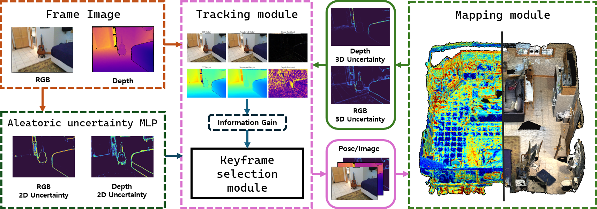

<div align=center>

# BayesianGS-SLAM: Uncertainty-Aware Neural Rendering SLAM via Probabilistic Formulation

  <p align="center">
    <a href="https://sites.google.com/view/thithin/"><strong>Kyeongsu Kang</strong></a>
    ·
    <a href="https://riboha.github.io/"><strong>Seongbo Ha</strong></a>
    ·
    <a href="https://sibaek-lee.github.io/"><strong>Sibaek Lee</strong></a>
    ·
    <a href="https://bogus2000.github.io/"><strong>Hyeonwoo Yu</strong></a>
  </p>


<h3 align="center"> IEEE Robotics and Automation Letters, 2026 </h3>

[ArXiv](https://arxiv.org/abs/2609.24140) | [Video](https://www.youtube.com/watch?v=6AhWxyfViuA)

</div>

## Overview



## Environment

### Clone the repository

```bash
git clone --recurse-submodules https://github.com/Lab-of-AI-and-Robotics/BayesianGS-SLAM.git
cd BayesianGS-SLAM
```

For an existing checkout, initialize the submodules with `git submodule update --init --recursive`.

### Create the Conda environment

```bash
conda env create -f environment.yml -n bayesiangs-slam
conda activate bayesiangs-slam
```

### Install the local dependencies


```bash
python -m pip install setuptools wheel ninja
python -m pip install --no-build-isolation ./thirdparty/simple-knn
python -m pip install --no-build-isolation ./thirdparty/gaussian_rasterizer_var
python -m pip install --no-build-isolation ./thirdparty/diff-gaussian-rasterization-w-pose-var
python -m pip install -e ./thirdparty/Hierarchical-Localization
```


## Run

```bash
bash auto_base.sh 
```

or 

```bash
python run_slam.py /PATH/TO/CONFIG.yaml --keyframe_count 4
```


## Acknowledgement

Our implementation builds upon [LoopSplat](https://github.com/GradientSpaces/LoopSplat), [Gaussian-SLAM](https://vladimiryugay.github.io/gaussian_slam/index.html), and [VarSplat](https://github.com/anhthuan1999/varsplat).

## Citation

```bibtex
@article{TBD,
  title={BayesianGS-SLAM: Uncertainty-Aware Neural Rendering SLAM via Probabilistic Formulation},
  author={Kang, Kyeongsu, Ha, Seongbo ,Lee, Sibaek and Yu, Hyeonwoo},
  journal={TBD},
  year={2026}
}
```

```bibtex
@misc{kang2026bayesiangsslamuncertaintyawareneuralrendering,
      title={BayesianGS-SLAM: Uncertainty-Aware Neural Rendering SLAM via Probabilistic Formulation}, 
      author={Kyeongsu Kang and Seongbo Ha and Sibaek Lee and Hyeonwoo Yu},
      year={2026},
      eprint={2609.24140},
      archivePrefix={arXiv},
      primaryClass={cs.RO},
      url={https://arxiv.org/abs/2609.24140}, 
}
```